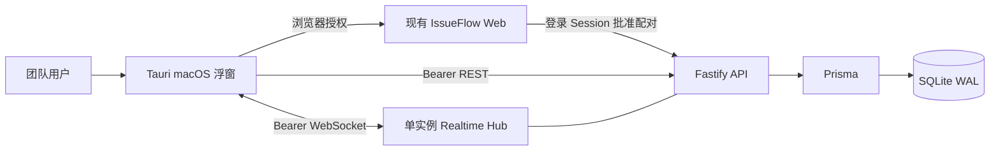

# IssueFlow macOS 浮窗提醒实施计划

> 状态：已实施并通过自动化验收；视觉验收与团队签名分发待后续执行

> 2026-09-01 验收快照：Codex 完成后端、共享契约、数据迁移与联调验收；Gemini 通过 `agy` 完成 Web 授权页和 Tauri 桌面端。整仓 186 项测试通过（Shared 11、API 55、Web 50、Desktop 70），各包类型检查、整仓构建、Rust 格式检查、42 项 Rust 测试、`cargo check` 与 Tauri debug 构建全部通过。全新 SQLite 数据库可依次应用 10 个迁移，迁移状态最新、Schema 无漂移，完整性及外键检查通过。按项目规范本轮未执行视觉检查；系统通知点击直达 Issue 仍按 F8 明确延期；Apple Developer 签名、公证、Universal DMG 与灰度分发仍属于阶段 4。
> 责任边界：后端由 Codex 实现并验证；桌面端与网页登录授权页由 Gemini 实现并验证  
> 目标平台：macOS  
> 桌面技术栈：Tauri 2 + React + TypeScript

## 1. 总览

### 1.1 产品目标

为 IssueFlow 增加一个常驻 macOS 菜单栏的轻量浮窗，让团队用户无需打开完整网页即可：

1. 及时获知“指派给我”和“提到我”的变化。
2. 快速查看“待我处理、关注中、最近关闭”的 Issue。
3. 在浮窗内完成 `OPEN / CLOSED` 状态切换。
4. 通过 WebSocket 在 1～3 秒内同步 Issue、通知和已读状态。
5. 从浮窗一键打开主站中的完整 Issue 详情。

首版是“提醒器 + 快速入口”，不是缩小版 IssueFlow。评论、改负责人、编辑正文、管理标签等复杂操作不进入浮窗。

### 1.2 已锁定决策

| 决策项 | 结论 |
|---|---|
| 使用范围 | 团队所有用户 |
| 首发平台 | 仅 macOS |
| 桌面框架 | Tauri 2 + React |
| 常驻方式 | 菜单栏常驻、全局快捷键呼出，可切换“始终置顶” |
| 默认快捷键 | `⌥⌘I`，可配置；冲突时提示用户重新设置 |
| 相关 Issue | 当前指派给我、提到我、我关注的 |
| 提及规则 | `@我` 后自动关注该 Issue |
| 取消指派 | 保持关注，用户可手动取消 |
| 状态操作 | 浮窗内可关闭/重新打开；关闭后提供 5 秒撤销 |
| 已读规则 | 展开提醒或打开对应 Issue 时标记已读；仅出现在列表中不算已读 |
| 系统提醒 | 指派、提及立即提醒；关注 Issue 仅状态或负责人变化提醒；自己触发的变化不提醒 |
| 默认分区 | 待我处理、关注中、最近关闭 |
| 最近关闭 | 默认 7 天，可选 3/7/14/30 天 |
| 实时方案 | 单 API 实例 WebSocket，不引入 Redis 或跨实例消息总线 |
| 登录方式 | 桌面端打开浏览器，由已登录的 IssueFlow 网页确认授权 |
| 服务地址 | 内置团队默认地址，同时允许修改；生产仅允许 HTTPS/WSS，localhost 开发例外 |
| 后台启动 | 首次询问是否登录后启动；关闭窗口只隐藏，菜单“退出”才结束进程 |
| 降噪 | 全局开关、免打扰时段、单 Issue 静音 |

### 1.3 明确边界

本方案中的“多人协同可扩展”指：多个团队成员同时连接同一个 API 实例。首版不支持多 API 实例，因此不能承诺横向扩容后的跨实例实时事件一致性。

若未来改为多实例部署，必须在 WebSocket Hub 前增加 Redis/NATS 等跨实例消息总线；本期不预埋空实现、不增加相应运维依赖。

### 1.4 不在首版范围

- Windows、Linux、移动端。
- 浮窗内发表评论、编辑 Issue 正文、修改负责人/标签/里程碑。
- 离线修改和离线冲突合并。
- 多服务账号同时在线。
- 多 API 实例、Redis Pub/Sub、持久化事件总线。
- App Store 发布；首版采用团队内签名分发。

## 2. 成熟开源项目参考

前端不得凭空发明交互，也不得参考闭源产品截图进行像素级仿制。实现前必须逐项核对以下开源项目的公开交互和代码，再映射到 IssueFlow 设计系统。

| 开源参考 | 只借鉴什么 | IssueFlow 中的落点 |
|---|---|---|
| [Gitify](https://github.com/gitify-app/gitify) | 菜单栏常驻、统一通知流、标记已读/完成、取消关注、过滤与设置 | 菜单栏入口、未读角标、通知动作、关注/静音 |
| [Plane](https://github.com/makeplane/plane) | Issue 列表的信息层级、状态/负责人/标签元信息、视图与筛选思路 | 三分区列表、Issue 行、详情摘要、筛选 |
| [Maccy](https://github.com/p0deje/Maccy) | 菜单栏 + 全局快捷键双入口、键盘优先、快速搜索、回车执行 | 呼出方式、焦点管理、方向键导航、搜索与快捷操作 |
| [MeetingBar](https://github.com/leits/MeetingBar) | 菜单栏中展示时间敏感信息、一键执行主操作、登录后启动 | 顶部概览、单主操作、启动偏好 |

禁止事项：

- 不复制参考项目的品牌色、图标、Logo、文案或图片资产。
- 不使用 Linear、Raycast、Things 等闭源产品作为主要设计依据。
- 不为了“高级感”引入大面积毛玻璃、渐变、漂浮卡片或装饰动画。
- 不把所有按钮藏在 hover 中；键盘焦点与鼠标选择必须同等可发现。

## 3. 信息架构与交互

### 3.1 窗口形态

- 默认尺寸：`420 × 640`。
- 最小尺寸：`360 × 480`；最大尺寸：`520 × 760`。
- 点击菜单栏图标或按 `⌥⌘I` 显示/隐藏。
- 未开启置顶时，失焦自动隐藏；开启置顶时保持可见。
- 菜单栏图标展示未读状态：`0` 不显示数字，`1～99` 显示数字，超过 99 显示 `99+`。
- 只允许单实例运行。

### 3.2 主视图

从上到下固定为：

1. 顶栏：IssueFlow 标识、连接状态、未读数、置顶、设置。
2. 搜索框：搜索当前相关 Issue；窗口打开后直接输入即可聚焦。
3. 三个可折叠分区：
   - `待我处理`：未关闭且当前指派给我的 Issue。
   - `关注中`：未关闭、已关注、但当前未指派给我的 Issue。
   - `最近关闭`：最近 7 天关闭且仍与我相关的 Issue。
4. 底栏：最后同步时间、打开 IssueFlow 主站。

同一 Issue 只能进入一个分区，优先级为：`待我处理 > 关注中 > 最近关闭`。

默认排序：

1. 有未读变化的 Issue 优先。
2. 其余按 `updatedAt DESC`。
3. ID 仅作为稳定次级排序，不作为视觉主信息。

### 3.3 Issue 行

每行只展示：

- 状态图标与 `#ID`。
- 标题，最多两行。
- 关系原因：`指派给我 / 提到我 / 已关注`。
- 负责人头像或缩写、更新时间、未读点。
- 当前可执行的单一快捷动作：打开 Issue 时显示“完成”，关闭 Issue 时显示“重新打开”。

标签最多展示 2 个，其余以可访问的 `+N` 折叠；状态不能只依赖颜色表达。

### 3.4 摘要详情

点击 Issue 行进入同一窗口内的二级详情，不弹新窗口。内容包括：

- 返回、Issue ID、标题、状态。
- 当前负责人、标签、更新时间。
- 正文纯文本摘要，最多约 6 行；不在浮窗渲染远程图片或附件。
- 最近一条与用户相关的通知摘要。
- 操作：完成/重新打开、关注/取消关注、静音/取消静音、在主站打开。

进入详情即标记该 Issue 的当前用户未读通知为已读。返回列表时保留原滚动位置和折叠状态。

### 3.5 状态切换与撤销

1. 用户点击“完成”。
2. 前端立即显示处理中状态，成功后将 Issue 移到“最近关闭”。
3. 底部出现 5 秒“已完成 · 撤销”提示。
4. 撤销调用现有状态更新接口改回 `OPEN`。
5. 若 `updatedAt` 乐观锁冲突，取消本地乐观状态，刷新服务端最新数据并明确提示“该 Issue 已被其他人修改”。

不得通过动画结束事件决定业务状态；动画可以取消，最终状态必须由请求结果决定。

### 3.6 通知与降噪

默认弹出 macOS 系统通知：

- 新指派给当前用户。
- 评论中首次或再次提到当前用户。
- 已关注 Issue 的状态变化。
- 已关注 Issue 的负责人变化。

默认不弹系统通知：

- 普通评论、正文编辑、标签变化。
- 当前用户自己触发的变化。
- 窗口正在前台且对应 Issue 详情已打开。
- 免打扰时段或单 Issue 静音期间。

静音只抑制系统通知，不影响 WebSocket 同步、列表更新和未读状态。

### 3.7 空、错、离线状态

- 无待处理项：显示简短成功状态，不显示营销式插画。
- 首次加载：使用固定高度骨架，避免列表跳动。
- WebSocket 断开：顶部显示非阻塞的“正在重连”；保留最近一次成功快照。
- REST 同步失败：显示“数据可能已过期”和重试按钮。
- 离线时禁用状态修改、关注和已读写入，不进行离线队列。
- 认证失效：清理本地凭据，回到重新授权页，不反复弹系统通知。

## 4. 视觉与可访问性约束

### 4.1 现有设计系统优先

必须读取并沿用 `design-system/issueflow/MASTER.md`：

- 字体：Inter；macOS 原生控件可使用系统字体。
- 主色：Teal `#0D9488`。
- 强调色：Orange `#EA580C`，仅用于少量关键操作或提醒。
- 风格：Flat、Minimal、Dense Dashboard。
- 间距：现有 4/8px 节奏。
- 图标：沿用项目已有 `lucide-react`，不可混入另一套图标库。
- 动效：只用透明度和位移，150～200ms；遵守 `prefers-reduced-motion`。

浮窗是桌面工具，不照搬 Master 中面向网页 Landing Page 的页面结构、响应式断点或滚动揭示动画。

### 4.2 可访问性验收

- 所有操作可通过键盘完成；Tab 顺序与视觉顺序一致。
- `↑/↓` 移动列表选择，`Enter` 打开，`Esc` 返回或隐藏窗口，`⌘K` 聚焦搜索，`⌘,` 打开设置。
- 所有焦点状态可见，不允许 `outline: none` 后无替代。
- 图标按钮必须有可访问名称；装饰图标对辅助技术隐藏。
- 未读数变化使用单一、完整的状态播报，不把每个数字角标都设为 live region。
- 正常文本对比度至少 4.5:1，非文本控件状态至少 3:1。
- 颜色不是唯一状态信号；状态同时使用图标或文字。
- 字体放大到 200% 时，不截断主操作、不产生水平滚动。

## 5. 系统架构



关键约束：

- Bearer Token 只存在于 Tauri Rust 层和 macOS Keychain，不暴露给 React、URL、日志或 WebSocket query string。
- React 通过有限的 Tauri command 调用 Rust 网络层；禁止提供任意 URL/任意方法的通用代理命令。
- WebSocket 使用 `Authorization: Bearer ...` 请求头认证。
- 当前只维护一个进程内连接 Hub；服务重启后客户端重连并重新拉取完整快照。
- Nginx 必须正确代理 Upgrade/Connection 头，并把 WebSocket 超时调整到高于心跳周期。

## 6. 后端计划（Codex）

### B1. 共享契约与数据迁移

在 `packages/shared` 增加并导出桌面端请求/响应 Schema 与类型，禁止桌面端另写一份不一致的类型。

Prisma 迁移：

1. 扩展 `ApiToken`：增加 `kind`（默认 `PERSONAL`）和可空 `deviceName`，桌面 Token 使用 `DESKTOP`。
2. 新增 `DesktopPairing`：保存配对 ID、设备名、用户码哈希、设备 Secret 哈希、批准用户、过期/批准/消费时间。
3. 新增 `DesktopPreference`：按用户保存系统通知开关、各事件开关、免打扰时段、时区、最近关闭天数。
4. 新增 `IssueNotificationMute`：`userId + issueId` 唯一，用于单 Issue 静音。
5. 所有新表补充用户/Issue 删除级联与必要索引。

默认值：

- 配对有效期 10 分钟，轮询间隔 5 秒。
- 桌面 Token 有效期 365 天，可在现有 API Token 页面撤销。
- 最近关闭 7 天。
- 指派、提及、状态变化、负责人变化的系统通知开；普通评论提醒关。

### B2. 浏览器配对授权

新增路由模块 `apps/api/src/routes/desktopAuth.ts`：

| 方法 | 路径 | 认证 | 用途 |
|---|---|---|---|
| `POST` | `/api/desktop/pairings` | 无 | 桌面端创建短期配对请求 |
| `GET` | `/api/desktop/pairings/verify?code=` | Session | 网页展示待授权设备信息 |
| `POST` | `/api/desktop/pairings/approve` | Session | 当前网页用户批准设备 |
| `POST` | `/api/desktop/pairings/:id/exchange` | 设备 Secret | 桌面端轮询并一次性换取 Token |

安全要求：

- 用户码短、可输入，但数据库只存规范化后的 SHA-256。
- 设备 Secret 至少 256 bit，只返回桌面端一次，数据库只存摘要。
- approve 必须依赖现有 HttpOnly Session，不能接受 Bearer Token 代批。
- exchange 必须原子消费；Token 明文只能成功返回一次。
- 对创建、验证、交换接口做速率限制和过期清理。
- 响应和日志不得包含完整 Token、Secret 或 Cookie。

### B3. “与我相关”聚合接口

新增 `GET /api/desktop/overview`，一次返回浮窗需要的最小数据：

```ts
interface DesktopOverview {
  generatedAt: string;
  unreadCount: number;
  sections: {
    assignedOpen: DesktopIssueSummary[];
    followedOpen: DesktopIssueSummary[];
    recentlyClosed: DesktopIssueSummary[];
  };
  totals: {
    assignedOpen: number;
    followedOpen: number;
    recentlyClosed: number;
  };
}
```

查询规则：

- `assignedOpen`：`OPEN` 且 `assignees.some(userId = me)`。
- `followedOpen`：`OPEN` 且 `subscriptions.some(userId = me)`，排除当前指派给我的 Issue。
- `recentlyClosed`：`CLOSED`、`closedAt >= now - closedDays`，且当前指派或已关注。
- 每区默认最多 50 条；返回真实总数，超出部分引导用户打开主站。
- 每条附带当前用户未读数、是否静音、是否关注、关系原因、负责人、最多 2 个标签。
- 排序为 `hasUnread DESC, updatedAt DESC, id DESC`。

### B4. 提及自动关注与通知语义

调整评论创建/编辑流程：

1. 在同一事务内解析被提及用户并为其 `upsert Subscription`。
2. 被提及用户收到 `MENTIONED` 通知；普通订阅者仍收到 `COMMENT / COMMENT_EDITED`。
3. 同一用户既是订阅者又被提及时只生成一条通知，以 `MENTIONED` 为准。
4. 编辑评论移除旧提及时不自动取消关注。
5. 操作者仍从通知接收人中排除。

重构 `notifyIssue`，使其返回实际创建的 Notification，便于事务提交后向准确用户发布 WebSocket 事件。

### B5. 已读、设置与静音接口

新增或扩展：

| 方法 | 路径 | 用途 |
|---|---|---|
| `PATCH` | `/api/issues/:id/notifications/read` | 标记当前用户在该 Issue 下的全部未读通知 |
| `GET` | `/api/desktop/preferences` | 获取跨设备桌面偏好 |
| `PATCH` | `/api/desktop/preferences` | 更新可同步偏好 |
| `GET` | `/api/desktop/notification-mutes` | 获取当前用户全部单 Issue 静音状态 |
| `PUT` | `/api/issues/:id/notification-mute` | 设置单 Issue 静音 |
| `DELETE` | `/api/issues/:id/notification-mute` | 取消单 Issue 静音 |

快捷键、窗口尺寸、置顶状态、是否登录后启动属于设备本地设置，不写入服务端。

### B6. 单实例 WebSocket Hub

依赖采用与 Fastify 5 兼容的 `@fastify/websocket`，必须在相关路由之前注册。

新增：

- `apps/api/src/realtime/hub.ts`：维护 `Map<userId, Set<WebSocket>>`。
- `apps/api/src/realtime/events.ts`：定义事件判别联合类型。
- `apps/api/src/routes/realtime.ts`：`GET /api/realtime` WebSocket Upgrade。

服务端事件：

```ts
type RealtimeEvent =
  | { type: "hello"; protocolVersion: 1; serverTime: string }
  | { type: "issue.changed"; issueId: number; updatedAt: string; actorId: number }
  | { type: "notification.created"; notification: DesktopNotification }
  | { type: "notification.read"; issueId: number | null; notificationIds: number[]; readAt: string }
  | { type: "subscription.changed"; issueId: number; subscribed: boolean }
  | { type: "notification-mute.changed"; issueId: number; muted: boolean }
  | { type: "preferences.changed"; updatedAt: string }
  | { type: "ping"; sentAt: string };
```

连接策略：

- 握手阶段复用 `app.authenticate`，只允许 Bearer Token。
- 每用户可同时连接多台设备；单个 Token 限制合理连接数。
- 服务端每 25 秒发心跳；连续失活关闭连接。
- 每条消息限制大小；服务端不接受客户端业务写操作，所有写操作仍走 REST。
- 客户端收到事件后只做精确缓存更新或失效重拉，事件不是第二套业务 API。
- 服务端关闭时使用 1001 通知客户端重连。

### B7. 事件发布接入

在以下事务成功之后发布事件：

- Issue 创建、状态/负责人/正文/标签/里程碑变化。
- 评论创建、编辑、删除。
- 订阅变化。
- 通知创建、按 Issue 已读、全部已读。
- 云效 Webhook 导致的 Issue 状态变化。

不得在事务提交前推送。推送失败只记录受控日志，不回滚已经成功的业务事务；客户端会在重连/失效重拉时收敛到数据库状态。

### B8. Nginx 与部署

- 为 `/api/realtime` 配置 WebSocket Upgrade。
- `proxy_read_timeout` 调整为至少 75 秒；25 秒心跳保证连接活跃。
- 生产桌面端拒绝明文 HTTP/WS，部署文档明确要求 HTTPS/WSS。
- Docker 仍保持单 API 容器，不新增 Redis。

### B9. 后端测试与验收

至少覆盖：

- 三分区查询、去重、排序、最近关闭边界。
- 提及自动关注、重复提及、评论编辑、操作者排除。
- 配对过期、错误码、重复批准、重复交换、Token 撤销。
- WebSocket 未认证拒绝、同用户多连接、不同用户隔离、心跳与关闭。
- Issue 状态变化、通知创建、已读、订阅变化的实时事件。
- 事务失败时不得推送幽灵事件。
- 现有网页通知和 Issue API 回归测试保持通过。

后端完成门槛：`pnpm --filter @issueflow/api typecheck` 与 API 测试全部通过。按项目规则不做视觉检查。

## 7. 前端计划（交给 Gemini）

### F1. 工程边界

Gemini 新增 `apps/desktop`，不得大改 `apps/web` 或复制整个现有 Web 应用。

建议结构：

```text
apps/desktop/
  src/
    app/
    components/
    features/auth/
    features/overview/
    features/issue-detail/
    features/settings/
    lib/contracts/
    lib/tauri/
  src-tauri/
    src/auth/
    src/http/
    src/realtime/
    src/settings/
```

`apps/web` 只新增桌面授权确认页和必要路由；公共 Schema 从 `@issueflow/shared` 引入。

### F2. Tauri Rust 层职责

- 单实例、菜单栏、窗口显示/隐藏、置顶、失焦隐藏。
- 注册/修改全局快捷键。
- 登录后启动配置。
- 打开系统浏览器和主站 Issue URL。
- 请求 macOS 通知权限并发送系统通知。
- 通过 macOS Keychain 保存 Bearer Token；建议使用维护活跃的 [keyring-rs](https://github.com/open-source-cooperative/keyring-rs)，不得写入明文配置文件。
- Bearer REST 与 WebSocket 连接全部由 Rust 层持有。
- 只向 React 暴露有限、类型明确的 commands 和领域事件。

禁止：

- Token 进入 React state、localStorage、URL、query string、错误文案或日志。
- React WebView 直接访问任意远程 URL。
- 暴露一个可接受任意 URL/任意 HTTP method 的通用 Tauri command。

### F3. React 层职责

- 登录/配对状态机。
- 三分区 Overview 与搜索。
- 二级 Issue 摘要详情。
- 状态切换、5 秒撤销、乐观锁冲突恢复。
- 设置页、免打扰、静音、最近关闭天数。
- WebSocket 领域事件对 TanStack Query 缓存的精确更新/失效。
- 键盘导航、焦点恢复、屏幕阅读器状态播报。

### F4. 必须实现的界面状态

1. 首次启动：默认服务地址、连接测试、浏览器授权按钮。
2. 等待授权：显示用户码、剩余时间、重新打开浏览器、取消。
3. 授权成功：通知权限与登录后启动的渐进式设置。
4. 主列表：加载、正常、空、离线、认证失效。
5. Issue 详情：正常、写操作中、冲突、错误。
6. 设置：提醒类型、免打扰、最近关闭天数、快捷键、置顶、开机启动、退出登录。

### F5. 键盘和菜单栏行为

- 打开窗口后，选中上次位置；若无记录则选中第一条 Issue。
- `↑/↓` 移动，`Enter` 进入详情，`Esc` 返回；主视图按 Esc 隐藏。
- `⌘K` 搜索，`⌘,` 设置，`⌘R` 手动同步。
- 搜索无结果时保持搜索框焦点，并提供清除按钮。
- 快捷键注册失败必须显示原因和恢复入口，不能静默失败。

### F6. 实时同步策略

1. Rust 建立 WebSocket 后先通知 React `connected`。
2. React 立即拉取完整 Overview，期间缓存到达的实时事件。
3. Snapshot 成功后按到达顺序应用缓存事件，再进入 `synced`。
4. 断线按 `1s / 2s / 5s / 10s / 30s` 退避重连，并加入少量抖动。
5. 重连成功重复 Snapshot 流程，避免断线期间遗漏。
6. 使用 Notification ID 和 Issue `updatedAt` 去重；同一写操作的 REST 响应与 WebSocket 回声不能造成重复提醒。

### F7. 本地缓存

- 仅缓存最后一次成功 Overview、非敏感设备设置和 UI 状态。
- 缓存必须带 `generatedAt`，离线时明确展示数据时间。
- Token 只存 Keychain。
- 退出登录时删除 Token、快照和当前服务关联设置，但保留用户选择的快捷键与开机启动偏好。

### F8. 系统通知点击行为

实现约束：当前采用的 Tauri 2 通知插件在 macOS 上没有经过验证的、可携带 Issue payload 的点击回调。首版不得伪造或宣称“点击直达 Issue”已完成；以下行为作为更换/扩展通知插件并完成真实 macOS 集成验证后的后续验收项。首版仍可从菜单栏、全局快捷键和通知后的 Overview 快速进入对应 Issue。

- 点击系统通知：显示浮窗并进入对应 Issue 详情。
- 成功打开详情后调用按 Issue 已读接口。
- Issue 不再可访问或已删除时，显示可恢复错误并刷新 Overview。
- 免打扰与静音判断在发送系统通知前完成；WebSocket 消息本身不得丢弃。

### F9. Gemini 实现前置检查

Gemini 开始写代码前必须：

1. 阅读本计划与 `design-system/issueflow/MASTER.md`。
2. 阅读 Gitify、Plane、Maccy、MeetingBar 的 README、公开截图和相关交互代码。
3. 输出一张“参考模式 → 本项目组件”的映射表，经确认后再实现。
4. 不修改本计划中已锁定的信息架构和交互边界；发现 API 不匹配时先报告，不自行发明接口。

### F10. 前端验证

- React 单元/组件测试：分区、排序、搜索、已读、撤销、冲突、离线和通知过滤。
- Rust 测试：服务地址校验、Keychain 封装、重连退避、通知过滤。
- Tauri 集成测试：菜单栏、快捷键、置顶、单实例、授权轮询、WebSocket 重连。
- 类型检查、构建和测试全部通过。
- 视觉检查由 Gemini 负责，至少覆盖普通/深色模式、键盘导航、200% 缩放和 reduced motion。

## 8. 实施顺序与联调门槛

### 阶段 0：契约先行

- Codex 完成 shared Schema、API 契约和示例 payload。
- Gemini 只可基于已合并契约搭建 mock，不得猜字段。

### 阶段 1：后端可用

- 完成配对授权、Overview、偏好/静音、按 Issue 已读。
- 完成 WebSocket Hub 和核心事件发布。
- 提供本地测试账号、授权流程和 WebSocket 调试说明。

### 阶段 2：桌面 MVP

- Gemini 完成 Tauri 壳、授权、菜单栏、三分区列表和主站跳转。
- 此阶段先完成真实 REST，再接 WebSocket，避免同时调试两套不稳定链路。

### 阶段 3：实时与快捷操作

- 接入 WebSocket、系统通知、状态切换、撤销、静音和已读同步。
- 联调重复事件、断线重连和乐观锁冲突。

### 阶段 4：团队分发

- 配置 Apple Developer 签名、公证和 Universal DMG。
- 配置 Tauri 签名更新源；自动更新上线前必须先验证回滚与旧版本兼容。
- 先让 3～5 名团队用户灰度使用，再扩大范围。

## 9. 总体验收标准

1. 团队用户可通过浏览器确认，在 1 分钟内完成桌面授权。
2. 应用常驻菜单栏，可通过图标和全局快捷键在 300ms 级别呼出已缓存界面。
3. 指派、提及、状态和负责人变化在正常网络下 1～3 秒内更新。
4. “待我处理、关注中、最近关闭”无重复、分类正确。
5. 提及会自动关注；取消指派不会自动取消关注。
6. 打开详情才标记已读，已读状态在 Web 与多台桌面设备间同步。
7. 状态切换遵守现有权限和 `updatedAt` 乐观锁；冲突不覆盖他人修改。
8. 免打扰和静音只抑制系统横幅，不丢失数据或未读状态。
9. Token 不出 Rust/Keychain，不出现在日志、URL、React 存储或错误报告中。
10. 服务端重启或网络恢复后，客户端重新拉取完整快照并最终与数据库一致。
11. 现有 Web 功能和测试无回归。
12. 单实例边界在部署文档中明确，不宣称支持横向扩容。

## 10. 主要风险

| 风险 | 处理方式 |
|---|---|
| 单实例 WebSocket 无法横向扩容 | 文档明确边界；未来多实例时单独引入消息总线 |
| 浏览器授权轮询被滥用 | 短时效、强 Secret、哈希存储、速率限制、原子消费 |
| Token 从 WebView 泄漏 | Token 和网络连接仅存在 Rust 层，React 不可读 |
| REST 与 WebSocket 双重回声 | 按 Notification ID 与 Issue `updatedAt` 去重 |
| 断线期间漏事件 | 重连先建立连接，再拉完整快照并回放暂存事件 |
| 通知过多 | 默认只提醒指派、提及、状态/负责人变化；提供免打扰和静音 |
| Tauri/macOS 行为与网页不同 | 优先遵守 macOS 菜单栏与键盘习惯，不生搬硬套网页组件 |
| 签名更新导致 Keychain 重复授权 | 固定 Bundle ID、Developer Team 和签名链，灰度验证更新 |
